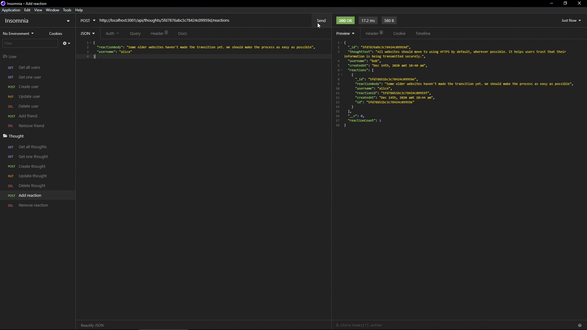

# Social Network API

## Description

A simple social media API using a NoSQL database. Users can friend each other, add thoughts, and react to each other's thoughts.

## Made with
- Node.js
- Express
- MongoDB
- Mongoose

## Installation

To install necessary dependencies, run the following command:

```
npm i
```

## Usage

Run
```
npm start
```
You can use Insomnia for testing the api endpoints. A demonstration video is linked to the image below.

[](https://drive.google.com/file/d/1zac3kgtOas2fev_FIXUL-gfgS-pyqeMw/view?usp=sharing)
